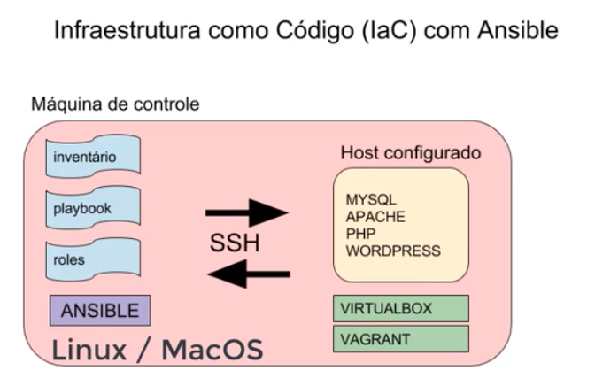

# Ansible-Wordpress
## Architecture 



## Roles

* Webserver
* Wordpress
* MySQL

# Rode o Playbook:

```
ansible-playbook -i hosts provisioning.yml
```

# Testes

```
$ ansible -u vagrant --private-key .vagrant/machines/wordpress/virtualbox/private_key -i hosts -m shell -a 'echo Hello, World'
```


